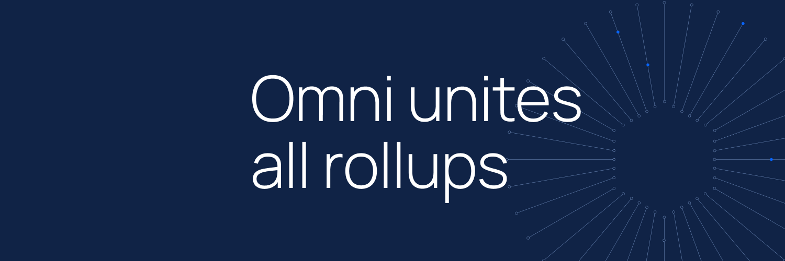

# Omni Advanced Cross-Rollup Staking Example



This repository contains an advanced example of a cross-chain dApp for staking tokens across multiple rollup networks. It showcases the use of an Omni contract for global state of cross-rollup staking operations and includes a frontend for user interactions.

## Repository Structure

```
|
├── frontend # Frontend React application for the dApp
│ ├── README.md # README for the frontend directory
│ ├── package.json # NPM package configuration
│ ├── public # Public assets and HTML template
│ ├── src # Source code for the React application
│ └── tsconfig.json # TypeScript configuration
├── lib # Libraries and dependencies
│ ├── forge-std # Standard library for Foundry
│ ├── omni # Omni protocol libraries
│ └── openzeppelin-contracts # OpenZeppelin smart contract libraries
├── script # Deployment and utility scripts
│ ├── *.s.sol # Solidity contract deployment scripts
│ └── bash # Bash scripts for deployment and dapp setup
├── src # Solidity contracts source
│ ├── GlobalManager.sol
│ ├── LocalStake.sol
│ └── LocalToken.sol
├── test # Tests for contracts
| ├── GlobalManager.t.sol
| └── LocalStake.t.sol
├── foundry.toml # Foundry build and test configuration
└── ...
```

## Contract Interaction

```
┌──────────────────────┐                     ┌──────────────────────┐
│                      │                     │                      │
│       Optimism       │                     │       Arbitrum       │
│                      │                     │                      │
│                      │                     │                      │
│     LocalToken.sol   ├───────┐      ┌──────┤    LocalToken.sol    │
│     LocalStake.sol   │       │      │      │    LocalStake.sol    │
│                      │       │      │      │                      │
│                      │       │      │      │                      │
│                      │       │      │      │                      │
└──────────▲───────────┘   (1) │      │ (1)  └───────────▲──────────┘
           │                   │      │                  │           
           │                   │      │                  │           
           │                   │      │                  │           
           │                   │      │                  │           
           │          ┌────────▼──────▼──────┐           │           
           │          │                      │           │           
           │          │       Omni EVM       │           │           
           │          │                      │           │           
           │          │                      │           │           
           └──────────┤   GlobalManager.sol  ├───────────┘           
                (2)   │                      │    (2)                
                      │                      │                       
                      │                      │                       
                      │                      │                       
                      └──────────────────────┘                       
```

Networks `Arbitrum` and `Optimism` post updates to the `GlobalManager` contract deployed on Omni (1). `GlobalManager` aggregates the state for both networks and is responsible for delegating actions dependent on this global state.

In the contract implementations in `src/`, `GlobalManager` verifies its global state before delegating an `unstake` operation to any of the deployed `LocalStake` contracts in whichever network.

:warning: **Note:** `GlobalManager` requires knowing what addresses have the deployed staking contract and their network to perform validity checks on state before delegating actions.

### How State is Managed Globally by `GlobalManager`

`GlobalManager` holds the following state:

```solidity
contract GlobalManager is XApp {
    address public owner;  // Owner of the contract
    mapping(uint64 => address) public chainIdToContract;  // Maps chain IDs to contract addresses
    mapping(address => mapping(uint64 => uint256)) public userToChainIdToStake;  // Maps user addresses and chain IDs to stake amounts
    uint256 public totalStake;  // Total staked amount across all chains

    /// @notice Initializes the contract with the portal address and sets the owner
    constructor(address portal) XApp(portal) {
        owner = msg.sender;
    }

    // further implementation...
```

The variables `chainIdToContract`, `userToChainIdToStake` and `totalStake` are updated as users add and remove stake across the configured rollups. 

#### Staking

Whenever a user stakes on any rollup, the staking contract on that rollup accepts the staked ERC20 tokens and calls the Portal contract to update the `GlobalManager` contract calling the `addStake` function which performs the following changes to state:

```solidity
        userToChainIdToStake[user][xmsg.sourceChainId] += amount;  // Adds the stake to the user's total on the specified chain
        totalStake += amount;  // Updates the total stake across all chains
```

#### Unstaking

Similarly, when a user unstakes on any rollup, the staking contract on that rollup first relays this information to the `GlobalManager` contract by calling the Portal first and calling the `removeStake` function on it which importantly **first performs validation checks against its state**. 

Given these validation checks pass (user has enough balance), it then proceeds by:

```solidity
        userToChainIdToStake[user][xmsg.sourceChainId] -= amount;  // Deducts the stake from the user's total
        totalStake -= amount;  // Updates the total stake

        xcall(xmsg.sourceChainId, xmsg.sender, data);  // Makes the cross-chain call to remove the stake
```

Here the `GlobalManager` contract is responsible for continuing the unstaking process because it is also responsible for performing the validation. This `xcall` then calls the contract where the unstaking operation came from, and completes it. 


### Applying This Framework to Other Apps

This model can be similarly applied to any application that suffers from fragmentation by being deployed to multiple rollups. Now instead, state can be managed globally in a central place, and network support for the application can be added incrementally with no adjustments to existing logic.

Some examples:

- Lending, where assets can be aggregated across rollups
- Gas payments, where balances on one network can pay for those in another
- Games, where assets in one network can be used in another
- Launchpads, accessing deeper liquidity across the Ethereum ecosystem

## Contract Deployment

Because `GlobalManager` requires knowledge of staking contract addresses and networks to perform verification checks it should be deployed first. Then the staking contracts should be deployed by chain, and the `GlobalManager` contract's state can be updated with the deployed addresses which it can use for validation.

The ERC20 and staking contracts follow. The deployment script in `script/bash/deploy.sh` performs this sequence for deployment, namely: 

1. Deploys the `GlobalManager` contract to the Omni EVM
2. Deploys the `LocalToken` contract and `LocalStake` to the first rollup (`Optimism` in this case)
3. Deploys the `LocalToken` contract and `LocalStake` to the second rollup (`Arbitrum` in this case)
4. Prints deployment addresses for all five contracts

To run this deployment, configure `script/bash/env.sh` first and then run:

```bash
sh script/bash/setup.sh
```

This will deploy the contracts according to the configured environment and add the deployed addresses of the staking contracts to the `GlobalManager` contract (by running `chain.sh`).

## Run the App Locally

### Run Networks and Omni Locally

To run the app locally make sure you have a running version of `devnet`. To run `devnet`:

1. First clone `https://github.com/omni-network/omni`
2. then run `make build-docker`
3. then run `make devnet-deploy`

### Contracts Setup

Having run this, you can find the address for the Portal contracts by running:

```bash
cat e2e/runs/devnet1/validator01/config/network.json
```

Add this Portal contract address to `script/bash/env.sh`.

You will need a `PRIVATE_KEY` environment variable for running the scripts too, we can use the [`anvil`](https://book.getfoundry.sh/reference/anvil/) rich keys:

```bash
export PRIVATE_KEY=0xac0974bec39a17e36ba4a6b4d238ff944bacb478cbed5efcae784d7bf4f2ff80
```

Now you can run:

```
sh script/bash/setup.sh
```

The contract addresses will be shown on your terminal output.

### Frontend Setup

Ensure the addresses shown before match those seen in `frontend/src/constants/networks.ts`. 

Then change directories into `frontend/` and run:

```bash
yarn && yarn start
```

Use the previously used anvil rich key to sign into metamask and interact with the app :)
