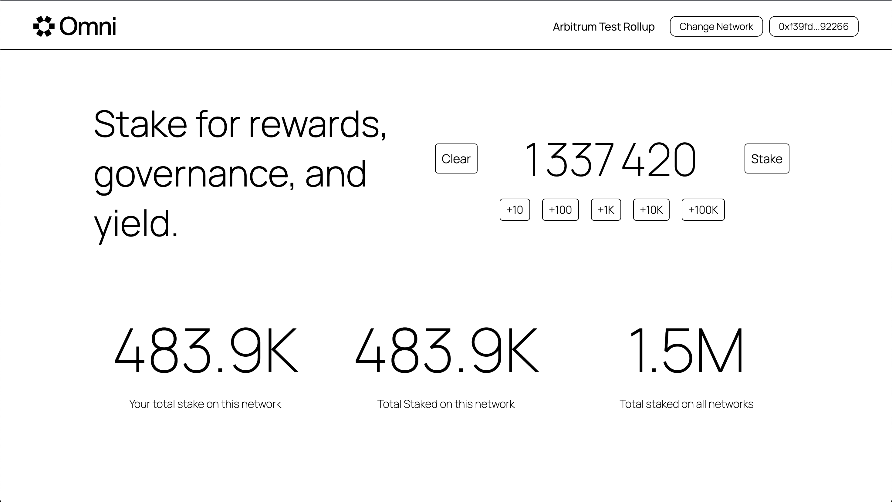

# Omni Cross-Rollup Staking Example Frontend

This is the frontend for a cross-chain dApp that allows users to stake tokens across multiple rollup networks. The dApp is built with React and interacts with three EVM Networks, two networks have the staking contracts and ERC20 contracts deployed to them and the last is the Omni EVM network that manages state globally.

## Overview

The frontend is a user interface that interacts with the `LocalStake`, `GlobalManager`, and `LocalToken` smart contracts to enable staking on the Omni network. Users can connect their Ethereum wallets, switch networks, and manage their stakes.



## Features

- **Wallet Connection**: Allows users to connect their MetaMask wallet to interact with the dApp.
- **Network Switching**: Users can switch between different rollup networks.
- **Stake Management**: Users can stake and view their current and total stakes on the network.

# Project Structure

```
├── README.md
├── package.json
├── public
│   ├── favicon.svg
│   ├── index.html
│   ├── logo.svg
│   ├── manifest.json
│   └── robots.txt
├── src
│   ├── App.css
│   ├── App.tsx
│   ├── abis
│   │   ├── GlobalManager.json
│   │   ├── LocalStake.json
│   │   └── LocalToken.json
│   ├── components
│   │   ├── LoadingModal
│   │   │   ├── LoadingModal.css
│   │   │   └── LoadingModal.tsx
│   │   ├── Navbar
│   │   │   ├── Navbar.css
│   │   │   └── Navbar.tsx
│   │   ├── StakeInput
│   │   │   ├── StakeInput.css
│   │   │   └── StakeInput.tsx
│   │   └── StakingStats
│   │       ├── StakingStats.css
│   │       └── StakingStats.tsx
│   ├── constants
│   │   └── networks.ts
│   └── index.tsx
├── tsconfig.json
└── yarn.lock
```

## Getting Started

To run this project locally, follow these steps:

1. Clone the repository:

    ```sh
    git clone https://your-repository-url
    ```

2. Change directory to the repo and install packages with: 

    ```sh
    yarn install
    ```

3. Start the development server:

    ```sh
    yarn start
    ```

## Components

- `Navbar`: The navigation bar allows the user to connect their wallet and switch networks.
- `StakeInput`: A component that allows users to input the amount of tokens they wish to stake.
- `StakingStats`: Displays the staking statistics such as total stakes on the network and the user's stakes.
- `LoadingModal`: A modal that appears during transaction processing.

## Smart Contract ABIs

The ABIs for the `LocalStake`, `GlobalManager`, and `LocalToken` contracts are located in the src/abis/ directory.

## Constants

The src/constants/ directory contains the `networks.ts` file, which holds the configuration for different networks and contract addresses.
